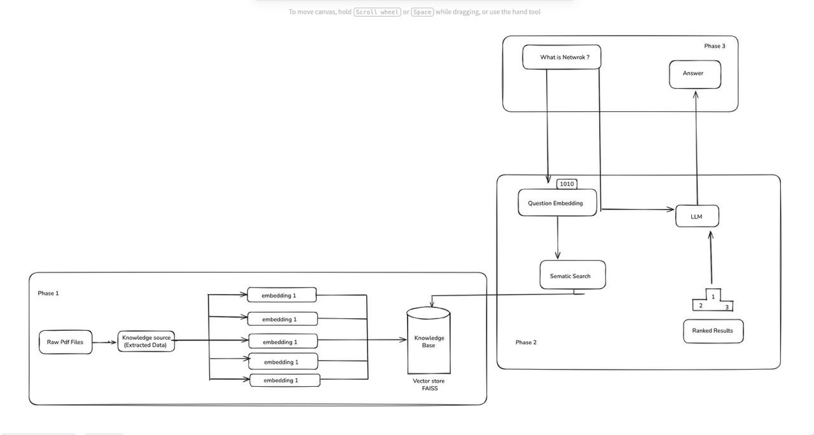

                    📘 RAG-Powered AI Chatbot using Mistral (HuggingFace API)
HCLTech Campus Hiring – GenAI Hackathon Submission
____________________________________________________________________________________________________
🚀 Project Overview

This project is a Retrieval-Augmented Generation (RAG) powered chatbot built using Python, FAISS, and the Mistral model from HuggingFace (via API key).

Our solution is divided into three clearly defined phases as required by the problem statement:

Data Ingestion & Vector Store Creation

LLM Memory + RAG Pipeline Integration

Frontend Chatbot Interface + End-to-End Workflow

____________________________________________________________________________________________________
✅ Phase 1 — Data Ingestion, Chunking, Embedding & Vector DB

In the first phase, we prepare the knowledge base that the chatbot will use for retrieval.

1️⃣ Load PDFs

First we will add the document(PDF). These documents are extracted into raw text using:

--> PyPDFLoader (LangChain) OR pdfplumber

2️⃣ Split Text into Chunks

LLMs cannot process very long text directly.
Therefore, we break the text into overlapping chunks:

--->  Chunk size: 500 characters

--->  Chunk overlap: 50 characters

This helps preserve context while keeping embeddings clean.

3️⃣ Convert Chunks into Embeddings

We generate vector embeddings using a sentence-transformer model: all-MiniLM-L6-v2(prefebbly)

Embeddings convert text into high-dimensional vectors that capture meaning.

4️⃣ Store Vectors in FAISS Vector DB

We store all embeddings in a local FAISS index, enabling fast semantic search.

FAISS allows us to retrieve the most relevant chunks for any user query in milliseconds.

___________________________________________________________________________________________________
🧠 Phase 2 — Adding Memory & Connecting to the LLM (Mistral)

After building the vector database, we connect the retrieval pipeline to the LLM.

1️⃣ Creating Memory for the Chatbot

We add:

Retrieval memory: retrieves context from the PDFs

This ensures answers remain consistent and context-aware.

2️⃣ Connecting the LLM (Mistral from HuggingFace)

We use the Mistral Instruct Model via HuggingFace API: mistral-7b-instruct-v0.3

3️⃣ RAG Pipeline Working

When a user asks a question: ---->  The question is embedded.

FAISS retrieves the most relevant document chunks.

Those chunks are sent as context to the Mistral model.

Mistral generates a grounded, factual answer.

__________________________________________________________________________________________________

               💬 Phase 3 — Frontend Chat Interface & End-to-End Chat Flow

In the final phase, we build an interface where users can chat with the RAG system.

We implement this using:

🖥️ Streamlit Frontend

Clean layout

Chat UI with chat bubbles

Display of retrieved context 

____________________________________________________________________________________________________

✨ End-to-End Chat Flow

--->  PDFs → Chunked → Embedded → Saved in FAISS

--->  User asks a question

--->  Semantic search retrieves relevant context

--->  Mistral model generates answer
  
--->  Answer + context shown in the chat
 
--->  This completes the full RAG pipeline.


🧱 Tech Stack

              Component	                                         Technology

              LLM                                                Mistral (HuggingFace API)
              Vector DB                                          FAISS
              Embeddings                                         MiniLM (sentence-transformers)
              Framework                                          Python, LangChain
              Frontend                                           Streamlit
              PDF Processing                                     pyPDFLoader, pdfplumber
____________________________________________________________________________________________________
              ✨Library Used

              --> langchain
              --> langchain-community
              --> langchain_huggingface
              --> faiss-cpu
____________________________________________________________________________________________________
🎯 Key Features

-->   Fully working RAG architecture

-->   Uses Mistral (free HuggingFace API)

-->   Handles any number of PDFs

-->   Fast semantic search using FAISS

-->   Clean UI for chatting & document upload

____________________________________________________________________________________________________



____________________________________________________________________________________________________

## 🚀 Quick Start & Deployment

### Local Setup

1. **Clone the repository**
   ```bash
   git clone <your-repo-url>
   cd HCLTech_Hackathon_Team_Qubits
   ```

2. **Install dependencies**
   ```bash
   pip install -r requirements.txt
   ```

3. **Set up environment variables**
   - Create a `.env` file in the root directory
   - Add your Groq API key:
     ```
     GROQ_API_KEY=your_groq_api_key_here
     ```
   - Get your API key from: https://console.groq.com/

4. **Create vector store** (if not already created)
   ```bash
   python database.py
   ```

5. **Run the application**
   ```bash
   streamlit run main.py
   ```

6. **Access the app**
   - Open your browser and go to: http://localhost:8501

### Deployment Options

This project can be deployed using multiple methods:

1. **Streamlit Cloud** (Recommended - Easiest)
   - See `DEPLOYMENT.md` for detailed instructions
   - Push to GitHub and deploy via Streamlit Cloud dashboard
   - Add `GROQ_API_KEY` in Streamlit Cloud secrets

2. **Docker**
   ```bash
   docker-compose up -d
   ```

3. **Heroku**
   - Use the provided `Procfile`
   - Set environment variables in Heroku dashboard

4. **AWS/Azure/GCP**
   - Use Docker container
   - Deploy to container services (ECS, Cloud Run, etc.)

For detailed deployment instructions, see **[DEPLOYMENT.md](DEPLOYMENT.md)**

____________________________________________________________________________________________________

## 📋 Requirements

- Python 3.11+
- Groq API Key (Get from https://console.groq.com/)
- Vector store files in `vectorstore/db_faiss/`

____________________________________________________________________________________________________


